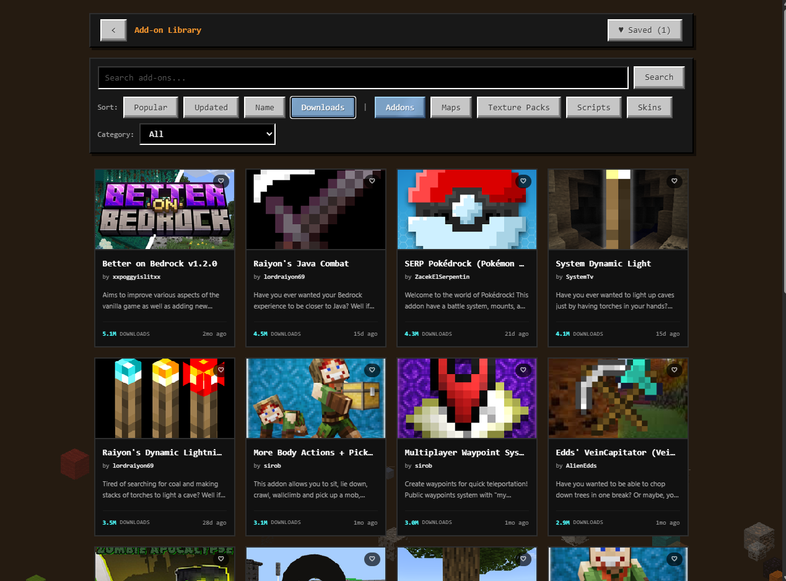

# MinecraftLab

Self-hosted Minecraft Bedrock server platform replacing Realms, built on Proxmox with a family-friendly web dashboard.

## What This Is

A complete setup for running Minecraft Bedrock servers at home with:

- **Per-world LXC containers** — each world runs in its own Proxmox container for independent backup/restore
- **Web dashboard** — mobile-friendly admin UI for non-technical users (parents, moderators)
- **CurseForge addon library** — browse, filter, and install 6,000+ Bedrock-native add-ons directly from the UI
- **Realms-style settings** — game mode, difficulty, and game rule toggles that work just like Realms
- **Player management** — allowlist, kick, per-player controls
- **Backup system** — safe LevelDB backups using BDS save hold/query/resume protocol
- **Zero port forwarding** — Playit.gg tunnel for player access, Tailscale for admin access
- **Console player support** — MCXboxBroadcast (Friends tab) + BedrockConnect (DNS fallback)

## Architecture

```
Browser → Next.js Web UI (CT 103) → BDS Wrapper API (CT 100/101) → Bedrock Server
```

| Container | Purpose |
|-----------|---------|
| CT 100 | BDS World 1 |
| CT 101 | BDS World 2 |
| CT 102 | Crafty Controller (optional) |
| CT 103 | Next.js Web Dashboard |
| CT 104 | Caddy Reverse Proxy |
| CT 105 | Playit.gg + MCXboxBroadcast |
| CT 106 | Uptime Kuma Monitoring |

## Components

### BDS Wrapper API (`bds-api.py`)

Lightweight Python HTTP API that runs alongside each Bedrock Dedicated Server. Controls BDS via screen stdin/stdout.

**Endpoints:**
- `GET /status` — server status, player list, version
- `GET /allowlist` — current allowlist
- `GET /backups` — list backup archives
- `POST /power` — start, stop, restart
- `POST /command` — send any BDS command
- `POST /allowlist/add` — add player to allowlist
- `POST /allowlist/remove` — remove player
- `POST /preset` — apply a game preset (kid_friendly, hard_survival, build_event, normal)
- `POST /backup` — trigger safe world backup
- `GET /addons` — list all installed packs (behavior + resource) on the server
- `GET /addons/world?name=<world>` — list packs active in a specific world
- `POST /addons/install` — download and install a `.mcpack`/`.mcaddon` from a URL into a world
- `POST /addons/remove` — remove a pack by UUID
- `POST /addons/toggle` — enable or disable a pack in a world without removing it

### Add-on Library (`webui/src/app/addons/`)

Integrated CurseForge add-on browser backed by the [Minecraft Bedrock game ID (78022)](https://www.curseforge.com/minecraft-bedrock) — exclusively Bedrock-native content.



**Features:**
- Browse 6,000+ add-ons: Addons, Maps, Texture Packs, Scripts, Skins
- Category filters: Weapons, Survival, Vanilla+, Magic, Fantasy, Roleplay, Technology, Horror, and more
- Sort by: Popular, Updated, Name, Downloads
- Install any add-on directly to a running world with one click
- Save/heart add-ons to a personal liked list (localStorage)
- Supports `.mcpack`, `.mcaddon`, and multi-pack `.zip` archives
- Detects and rejects Java Edition content with a clear error message

**Requires a CurseForge API key** — set `CURSEDFORGE_API=your_key` in `.env.local`.

### Web Dashboard (`webui/`)

Next.js 16 app with Tailwind CSS dark theme.

**Features:**
- Login with role-based access (admin / moderator / viewer)
- Dashboard showing all worlds with live status
- Per-world controls: start/stop/restart, backup
- Game mode selector (Survival / Creative / Adventure)
- Difficulty selector (Peaceful / Easy / Normal / Hard)
- Game rule toggles (Realms-style) with basic + advanced sections
- Player list with kick button
- Allowlist management
- Auto-refreshes every 5 seconds via SWR

**Tech stack:**
- Next.js 16 (App Router)
- Tailwind CSS v4
- iron-session (encrypted cookie auth)
- SWR (data fetching)

## Setup

### Prerequisites

- Proxmox VE 9.x
- Ubuntu 22.04 LXC template
- Debian 12 LXC template

### BDS Containers (CT 100, CT 101)

1. Create an unprivileged LXC container (Ubuntu 22.04, 2GB RAM, 2 cores)
2. Install BDS:
   ```bash
   mkdir -p /opt/bedrock && cd /opt/bedrock
   curl -L -A "Mozilla/5.0" "https://www.minecraft.net/bedrockdedicatedserver/bin-linux/bedrock-server-VERSION.zip" -o bds.zip
   unzip bds.zip && rm bds.zip
   chmod +x bedrock_server
   useradd -m -s /bin/bash minecraft
   chown -R minecraft:minecraft /opt/bedrock
   ```
3. Deploy `bds-api.py` to `/opt/bedrock/api.py`
4. Create systemd services for both BDS and the API (see `implementation-plan.md`)

### Web UI Container (CT 103)

1. Create an unprivileged LXC container (Debian 12, 2GB RAM, 1 core)
2. Install Node.js 20:
   ```bash
   curl -fsSL https://deb.nodesource.com/setup_20.x | bash -
   apt install -y nodejs
   ```
3. Set up the project:
   ```bash
   cd /opt
   npx create-next-app@latest family-mc-ui --typescript --tailwind --eslint --app --src-dir --yes
   cd family-mc-ui
   npm install iron-session swr clsx tailwind-merge
   ```
4. Copy `webui/src/` into `/opt/family-mc-ui/src/`
5. Create `.env.local` from `.env.example` with your actual values
6. Build and run:
   ```bash
   npm run build
   npm start
   ```

## Configuration

Copy `webui/.env.example` to `webui/.env.local` and edit:

```env
SESSION_SECRET=your-random-string-at-least-32-characters
USERS=admin:yourpassword:admin,parent:simplepass:moderator
BDS_API_TOKEN=your-api-token
SERVERS=world1|My World|192.168.1.100|8080,world2|World 2|192.168.1.101|8080
```

## Hardware

Designed for and tested on:
- Mac Mini 2019 (Intel i7-8700B, 64GB RAM, Apple NVMe)
- Proxmox VE 9.1
- Wired Ethernet

Should work on any Proxmox host with 8GB+ RAM.

## License

MIT
