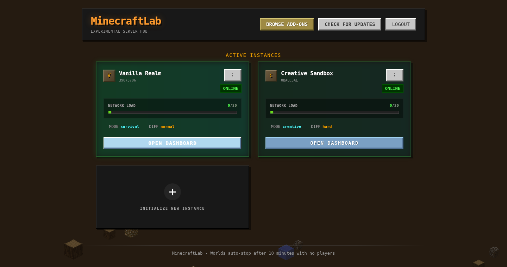
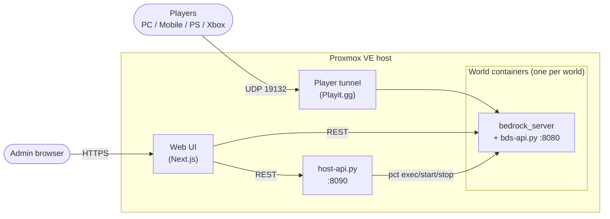
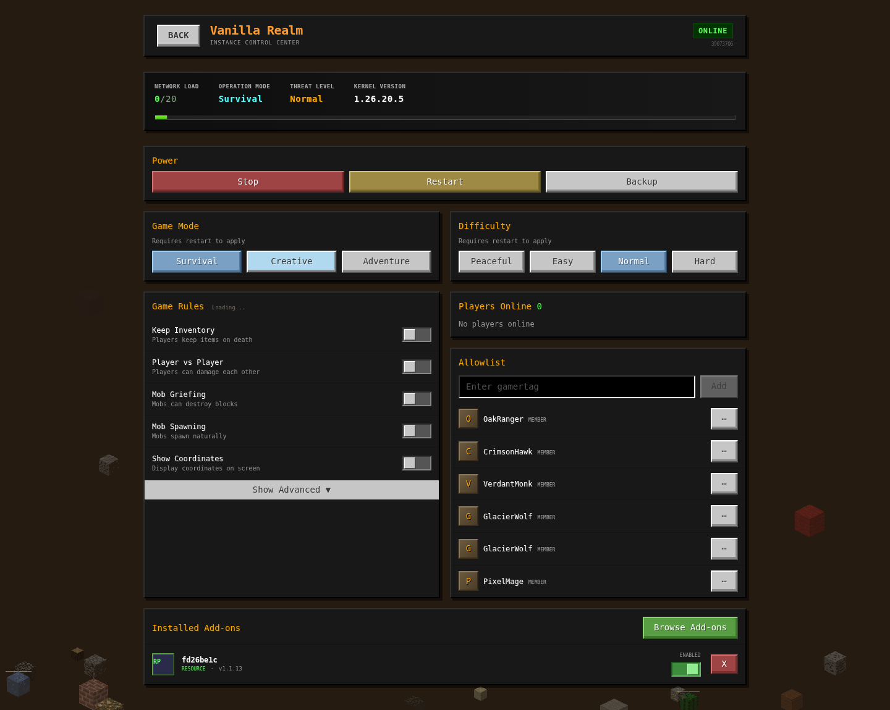
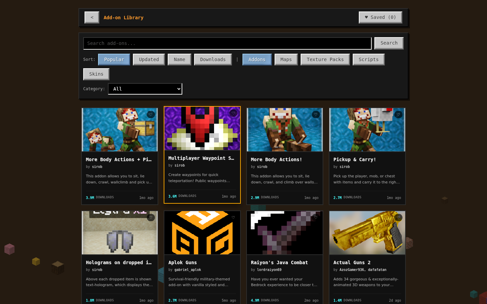

# MinecraftLab

> A self-hosted Minecraft Bedrock server platform with a custom web UI, container-per-world architecture, integrated CurseForge add-on browser, and PS5/Xbox player support — built as a Realms replacement on Proxmox.

[](LICENSE)
[](https://nextjs.org/)
[](https://tailwindcss.com/)
[](https://www.proxmox.com/)
[](https://www.minecraft.net/en-us/download/server/bedrock)



> Screenshots taken with the built-in demo mode (`Ctrl+Shift+D`) so world names and gamertags are placeholder data.

## Why this exists

Minecraft Realms is great — until you stop wanting to pay $10/month forever, want more than two worlds, want to install addons that aren't in the marketplace, or want full control over backups and uptime. The official Bedrock Dedicated Server (BDS) gives you all of that for free, but it ships with no UI, no addon manager, and no built-in way for console players to join. Most "MC server panel" projects (Pterodactyl, Crafty) are built around Java Edition.

MinecraftLab is a **self-hosted Realms replacement** that gives you the Realms experience on your own hardware: each world runs in its own LXC container, console players join via Xbox Live's Friends tab, addons install in one click from a built-in CurseForge browser, and the whole thing is managed through a Minecraft-styled web dashboard accessible to non-technical family members. Run it on a Mac Mini in a closet, an old desktop, or any spare Proxmox host.

## What it does

- **One container per world** — independent backups, resource limits, lifecycle management
- **Web dashboard** — mobile-friendly, role-based (admin/moderator), zero command-line for daily use
- **CurseForge addon library** — browse 6,000+ Bedrock-native add-ons, install with one click, save favourites
- **Realms-style settings** — gamemode, difficulty, and gamerule toggles with deferred-restart prompts
- **PS / Xbox player support** — optional community workaround that surfaces the server through the Friends tab (see Architecture for caveats)
- **Auto-update** — hourly version check + 12-hour backup-and-update sweep, both skip worlds with players online
- **Manual update button** — admin-only "Check for Updates" trigger for emergencies
- **Safe LevelDB backups** — uses BDS `save hold` / `save query` / `save resume` protocol
- **Realms world import** — drop a `.mcworld` export, get a fresh container running it
- **Zero port forwarding** — Playit.gg for player traffic, Tailscale for admin

## Architecture


```mermaid
flowchart LR
    Admin([Admin browser])
    Player([Players<br/>PC / Mobile / PS / Xbox])

    subgraph Proxmox["Proxmox VE host"]
        WebUI["Web UI<br/>(Next.js)"]
        HostAPI["host-api.py<br/>:8090"]
        Tunnel["Player tunnel<br/>(Playit.gg)"]

        subgraph Worlds["World containers (one per world)"]
            World["bedrock_server<br/>+ bds-api.py :8080"]
        end
    end

    Admin -->|HTTPS| WebUI
    Player -->|UDP 19132| Tunnel
    Tunnel --> World
    WebUI -->|REST| HostAPI
    WebUI -->|REST| World
    HostAPI -->|pct exec/start/stop| World
```

**Three-tier API:**
1. **`host-api.py`** (Proxmox host) — container lifecycle, world creation, BDS updates. Calls `pct` directly.
2. **`bds-api.py`** (per world) — server status, gamemode, difficulty, addons, allowlist. Talks to BDS via `screen` stdin.
3. **Next.js webui** — server-side API routes proxy to both APIs with shared bearer token.

> **Console-player support:** PS / Xbox players can join via a community-built workaround that surfaces the server through Xbox Live's Friends tab. It works well in practice, but it sits in a gray area of Microsoft's Xbox Services terms (it requires a Microsoft account that broadcasts the server as a "friend's game"). MinecraftLab does **not** ship or document this workaround — if you want it for your family, the open-source tools to do it are easy to find, but evaluate the trade-offs yourself.

## Screenshots

| Per-world dashboard | Add-on library |
|---|---|
|  |  |

## Tech stack

| Layer | Technology |
|---|---|
| Frontend | Next.js 16 (App Router), Tailwind CSS v4, SWR, iron-session |
| Backend (host) | Python `BaseHTTPRequestHandler`, `pct` shell calls |
| Backend (per-world) | Python wrapper around BDS via `screen` |
| Auth | iron-session encrypted cookies, role-based (admin/moderator/viewer) |
| Hypervisor | Proxmox VE 9 (LXC containers, vzdump backups) |
| Addon source | CurseForge API (gameId 78022 = Bedrock) |
| Console support | Optional Friends-tab workaround (not bundled) |
| Player tunnel | Playit.gg (UDP, no port forwarding) |
| Admin VPN | Tailscale |

## Project structure

```
minecraftlab/
├── host-api.py                    # Proxmox host service: container + update orchestration
├── bds-api.py                     # Per-world BDS wrapper API
├── scripts/
│   ├── nightly-maintenance.sh     # 12h backup + update cron
│   ├── update-check.sh            # Hourly version-check cron (skips if players online)
│   ├── bds-update.sh              # Apply a downloaded BDS zip to a container
│   └── bds-backup.sh              # Safe LevelDB backup (save hold protocol)
├── webui/                         # Next.js dashboard
│   ├── src/app/                   # Pages: dashboard, world detail, addon browser
│   ├── src/app/api/               # API routes proxying to host-api / bds-api
│   └── src/lib/                   # host.ts, bds.ts, curseforge.ts, session.ts
└── docs/
    ├── ARCHITECTURE.md            # Full architecture decision record
    └── SETUP.md                   # Step-by-step deployment
```

## Quick start

See [`docs/SETUP.md`](docs/SETUP.md) for the full guide. The TL;DR:

1. Provision Proxmox VE 9 with LXC containers per world (Ubuntu 22.04, 2GB / 2 cores each)
2. Install BDS in each world container, deploy `bds-api.py` as a systemd service
3. Run `host-api.py` on the Proxmox host as a systemd service (port 8090)
4. Provision a webui container (Debian 12, Node 20), deploy the Next.js app
5. Configure `.env.local` with your bearer token and host-api URL
6. Optional: set up Playit.gg (player tunnel), Tailscale (admin VPN)

## API reference

### `host-api.py` (port 8090, host-only)

| Method | Path | Purpose |
|---|---|---|
| `GET` | `/worlds` | List all worlds with status |
| `POST` | `/worlds` | Create a new world (clones standby template) |
| `POST` | `/worlds/<id>/start` | Start container |
| `POST` | `/worlds/<id>/stop` | Stop container |
| `DELETE` | `/worlds/<id>` | Destroy container + remove from registry |
| `GET` | `/standby` | Standby template provisioning state |
| `GET` | `/updates/check` | Latest BDS version + per-world status |
| `POST` | `/updates/apply` | Trigger update on outdated worlds |
| `GET` | `/updates/status` | Background update progress |

### `bds-api.py` (port 8080, per-container)

| Method | Path | Purpose |
|---|---|---|
| `GET` | `/status` | Online state, players, version, gamemode, difficulty |
| `GET` | `/allowlist`, `/permissions` | Player lists |
| `POST` | `/gamemode`, `/difficulty` | Update server.properties (deferred restart) |
| `POST` | `/command` | Send any BDS command via screen stdin |
| `POST` | `/allowlist/add`, `/allowlist/remove` | Manage allowlist |
| `POST` | `/backup` | Safe `save hold`-based backup |
| `GET` | `/addons`, `/addons/world` | List installed packs |
| `POST` | `/addons/install` | Download + install `.mcpack` / `.mcaddon` from URL |
| `POST` | `/addons/remove`, `/addons/toggle` | Manage addons in a world |
| `POST` | `/worlds/import` | Import a `.mcworld` archive |

## Status

Active hobby project. Used in production by a small group of family players. Open to issues and PRs.

**Roadmap:**
- [ ] Java Edition support (separate container template + RCON wrapper)
- [ ] Multi-host Proxmox cluster support
- [ ] Backup browser UI (currently CLI/SSH only)
- [ ] Player session timeline (who played when)

## License

[MIT](LICENSE) — do anything you want, no warranty.

This project is independent and not affiliated with, endorsed by, or associated with Mojang Studios or Microsoft. *Minecraft* is a trademark of Mojang Studios.
